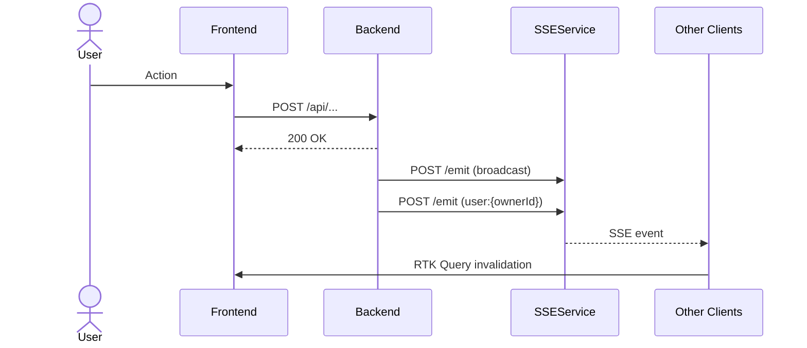

# Design: {{title}}

**ID:** DSGN-XXX
**Spec:** SPEC-XXX
**Author:** {{author}}
**Date:** {{YYYY-MM-DD}}
**Status:** draft

---

## Architecture Decisions

<!-- Record key decisions with rationale. Format: ADR style -->

### ADR-1: {{decision title}}
- **Decision:** …
- **Rationale:** …
- **Trade-offs:** …

---

## Component Map

<!-- Which files/classes are created or modified? -->

### backend
- `CategoryService.java` — modify `deleteCategory()`
- `SSENotificationService.java` — add `notifyXxx()`

### frontend
- `src/stores/services/XxxApi.ts` — invalidatesTags fix
- `src/components/Xxx/Xxx.tsx` — new component

### sse-service
- `config/channels.json` — add allowed_resource

---

## Sequence Diagrams

<!-- Use Mermaid. Describe the happy path + key error paths. -->



---

## Database Migrations

<!-- Include SQL or Liquibase changesets. Write "none" if no changes. -->

```sql
-- none
```

---

## API Contracts

<!-- OpenAPI-style. Include request body, response shape, and error responses. -->

### POST /api/{{resource}}

**Auth:** Bearer (role: ORGANIZER | ADMIN)

**Request Body:**
```json
{
  "field": "value"
}
```

**Response 200:**
```json
{
  "data": { ... },
  "message": "Success"
}
```

**Errors:**
- `400` — validation / business rule violation
- `403` — not authorized
- `404` — resource not found

---

## SSE Contract

<!-- New SSEAction + SSENormalizedType entries, payload shape -->

```typescript
// sse.ts additions
SSEAction.XXX_CREATE = 'xxx:create'
SSENormalizedType.XXX_CREATED = 'XXX_CREATED'

// Payload shape
{
  xxxId: number;
  xxxName: string;
}
```

---

## Frontend State Changes

<!-- RTK Query: new endpoints, tag changes, cache shape -->

```typescript
// OrganizerApi.ts — invalidatesTags pattern
invalidatesTags: (_result, _error, { id }) => [{ type: 'Organizer', id }, 'Organizer'],
```

---

## Rollback Plan

<!-- How to revert if this breaks production -->
-

---

> Next step: Create `TASK-XXX` in `changes/{{slug}}/tasks.md`
